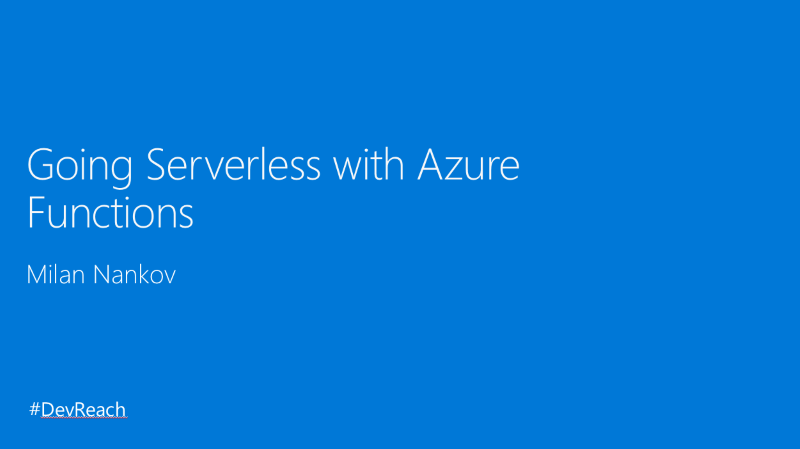

# DevReach2017
Slides and resources for my session at DevReach 2017 - Going Serverless With Azure Functions

[http://devreach.com/](http://devreach.com/)

## Abstract

Serverless has been a buzzword for some time now and it is time to explore what it has to offer to devs, IT, and the business. We will dive into the event-driven approach to building software systems which is fundamental to the serverless world. Of course, the focus of the talk will be on Azure Functions and how it can help us build responsive, cost-effective, and scalable apps. 

Additionally, you will learn about other technologies that are part of the Azure serveless platform – Azure Logic Apps, Azure Event Grid, Azure Storage, and more.  
